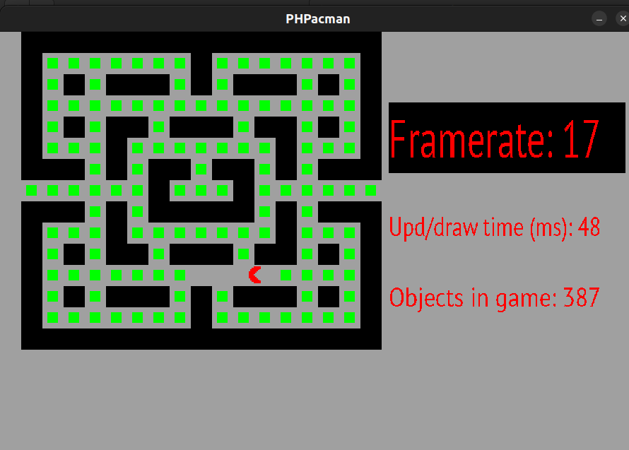

# PHPacman

PHP demo clone of classic game Pacman written with php-sdl2 package upon SDL2 library.

Note: framerate is slow due to lots of objects on the screen (some unseen for player).
Can be speed up by creating broad collision objects and deleting small ones.

Steps to run:
- Install SDL2 library (`libSDL2, libSDL2_image, libSDL2_mixer, libSDL2_ttf`)
- `composer install`
- `php src/main.php`